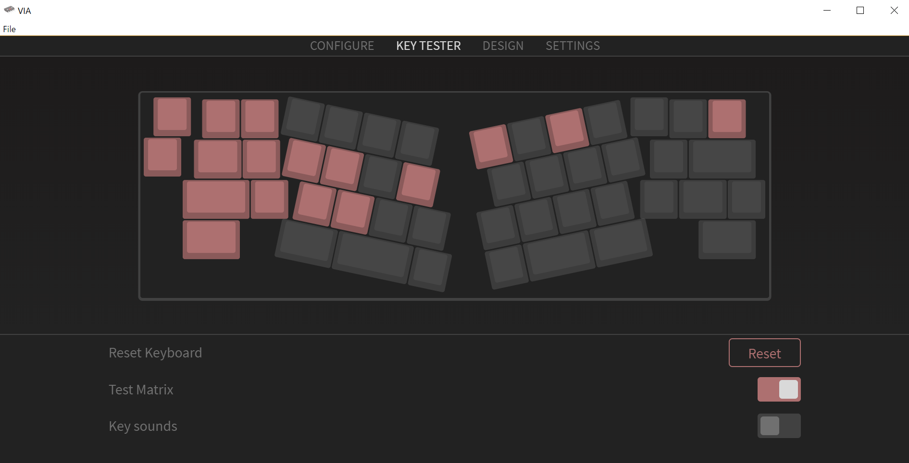
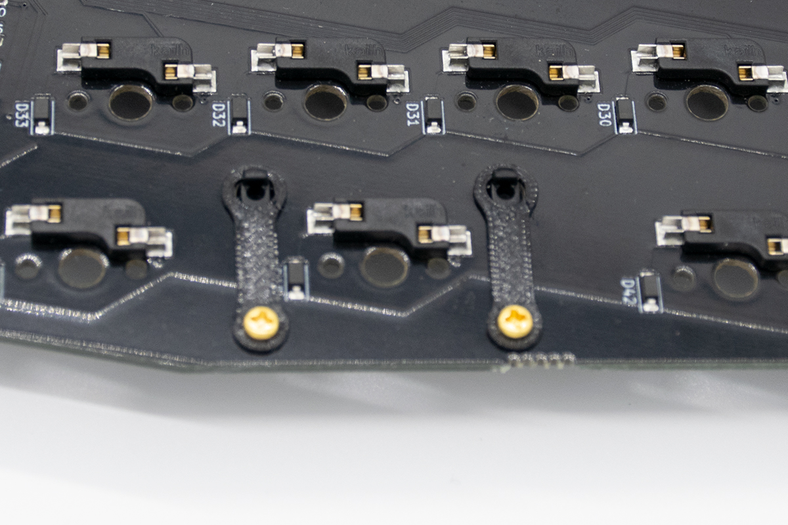
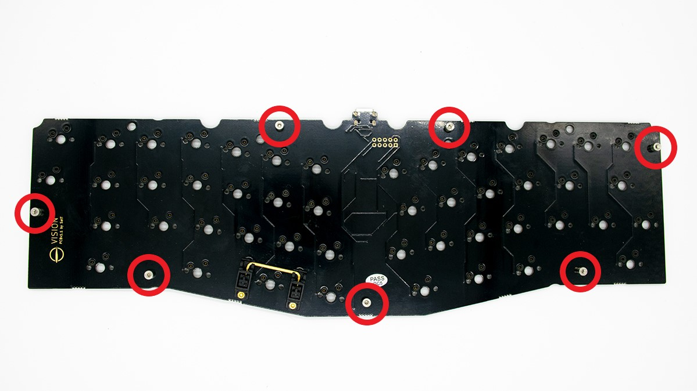
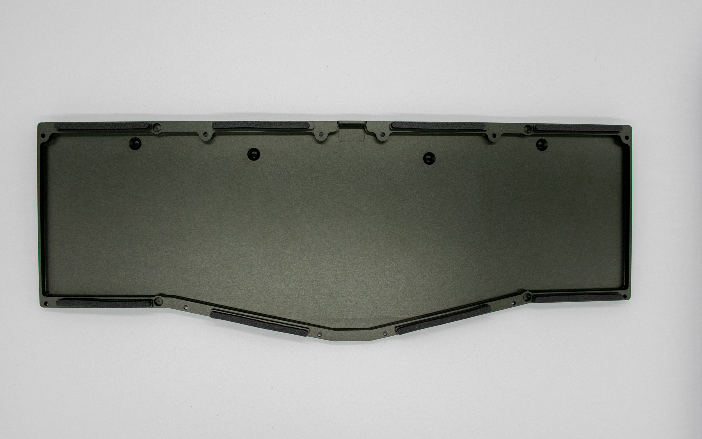
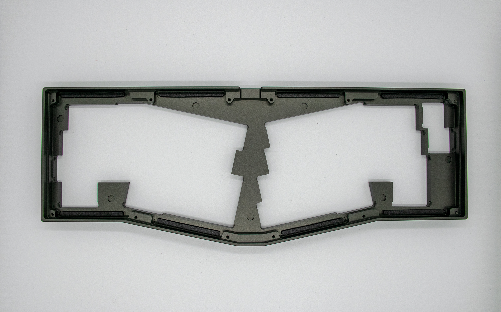
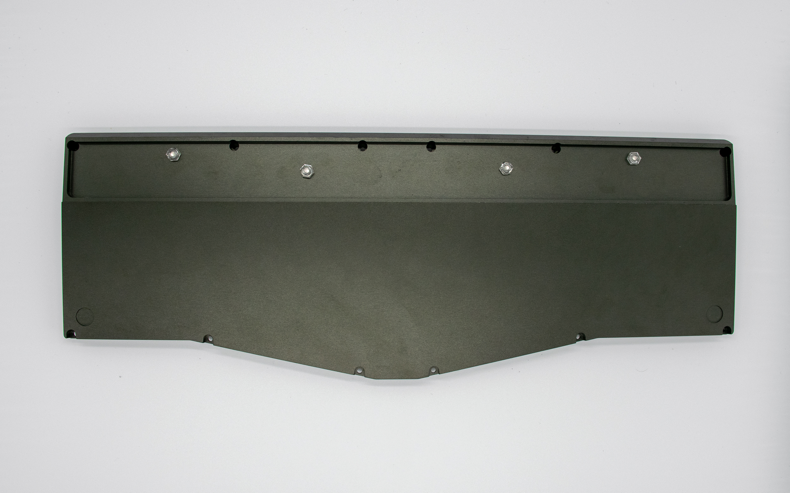
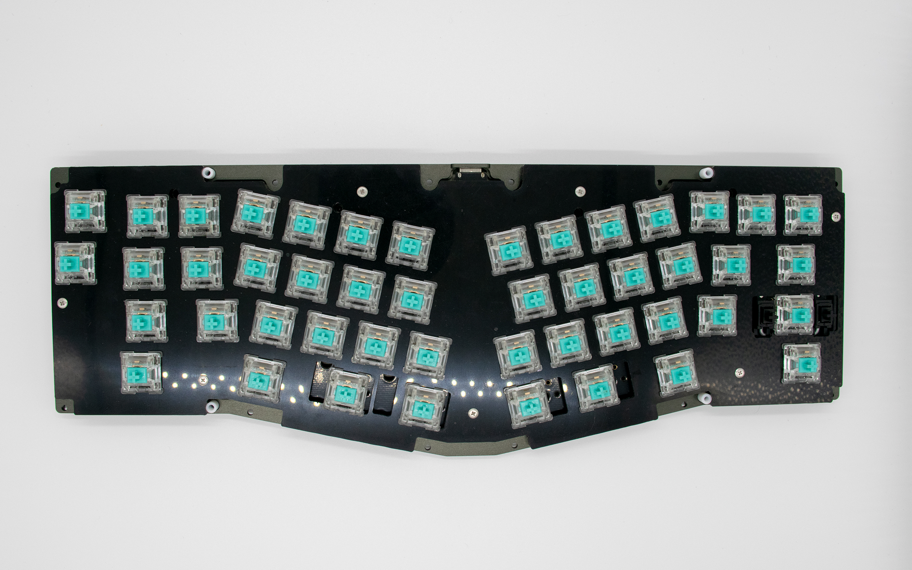
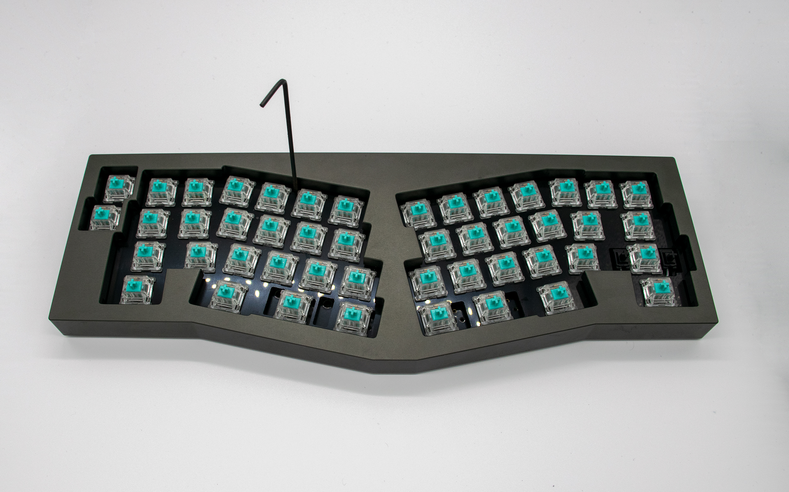
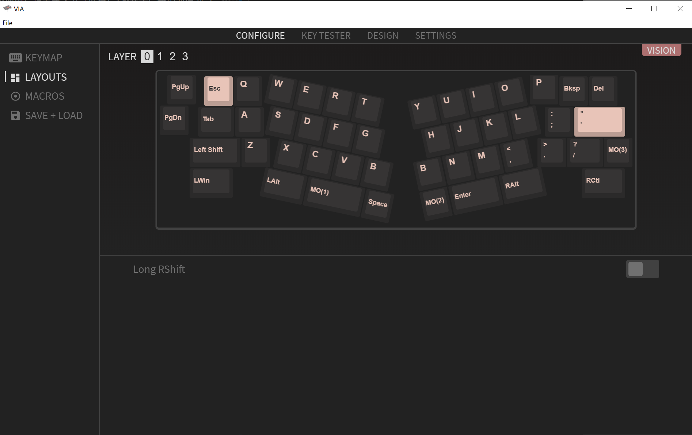
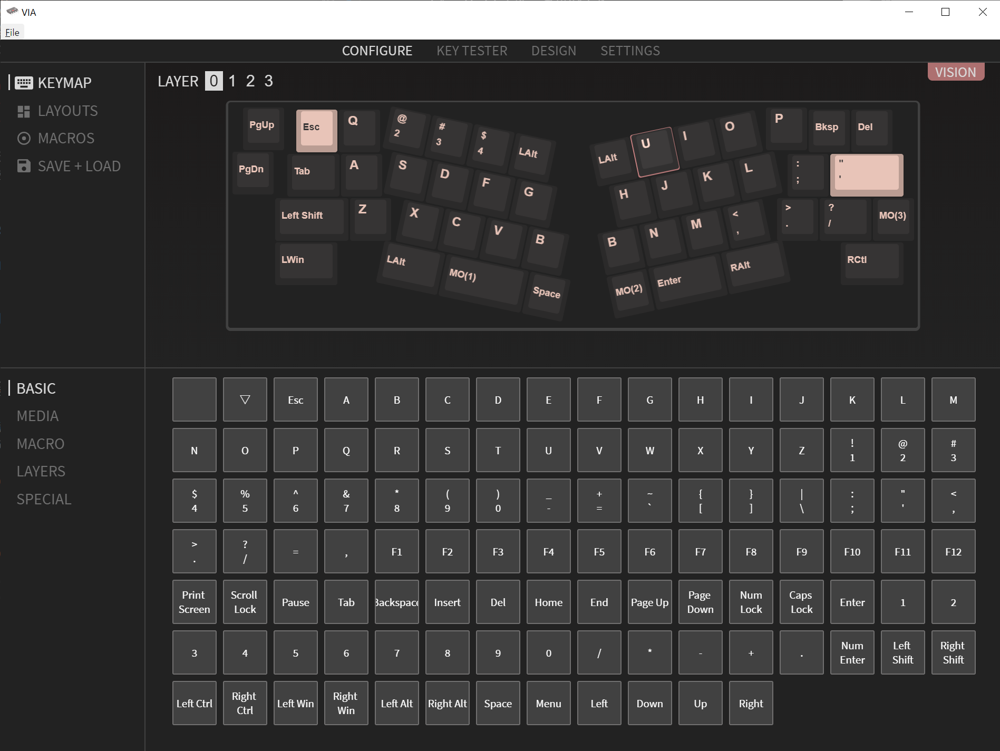

# Vision ビルドガイド
[Vision キーボードキット](https://satt.booth.pm/items/2148976)のビルドガイドです。  
組み立ての際は、本ビルドガイドの最後まで目を通した上で作業をはじめることを推奨します。

## 準備
最初に必要な部品および工具があることを確認します。
### 同梱品の確認
|パーツ|備考|
|---|---|
|トップケース|-|
|ボトムケース|-|
|ウェイト|-|
|M2-6mmネジ|12個（ケースに取り付け済み）|
|M3-6mm皿ネジ|4個（ケースに取り付け済み）|
|φ4-7mm樹脂スペーサー|4個（ケースに取り付け済み）|
|M3樹脂ナット|4個|
|1.5mm六角レンチ|1本|
|2.0mmボールポイント六角レンチ|1本|
|シール付きフォーム|16本|
|シリコン足|4個|
|アルミプレート|1枚|
|PCB|1枚|
|M2-3.5mmスペーサー|7個|
|M2-3mmネジ|14個|
|スタビライザシム|4個|

### 追加で用意する部品
|部品|個数|
|---|---|
|USB-C ケーブル|1本|
|MX互換スイッチ|47-48個|
|MX互換2uスタビライザ|0-2個（後述の理由でDurock/Everglide製がおすすめです）|
|MX用キーキャップ|47-48個|

### 工具
組み立てにはキットに含まれる工具に加え、以下が必要となります
|工具|備考|
|---|---|
|#0番プラスドライバー|-|
|ピンセット|-|
|はんだごて|Solderable基板を選択した場合のみ|

### 注意事項
* 一部のパーツは非常に重いです。落下、挟まれ等による怪我がないよう十分に注意して作業を進めてください。
* ネジを締めすぎないように注意してください。無理に力をかけてレンチを回すとネジ穴/頭が破損し、ケースが使用できなくなる恐れがあります。

## 組み立て
### PCBを組み立てる

1. はじめにPCBが正常に動作することを確認します
    * USB-Cケーブルを使いPCBをPCに接続し、ピンセット等で各キーのスルーホールをショートさせ、文字が入力されることを確認します
    * [VIA](https://github.com/the-via/releases/releases/)の`KEY TESTER`を使用するとどのキーが押されたか簡単に確認できます
   

1. 使用するレイアウトに合わせてスタビライザをPCBに取り付けます。取り付けの際、写真のようにスタビライザシムをPCBとスタビライザの間にはさみます。
    * DurockやEverglide等一部のスタビライザでは、Visionで使用している1.2mmのPCBであってもガタツキなく爪がひっかかるため、スタビライザシムは不要です。
   

1. PCBの7箇所の穴にM2-3mmネジを使用してM2-3.5mmスペーサーをネジ止めします。
   

1. 穴の箇所が一致するようPCBのスペーサーの上にプレートをのせ、M2-3mmネジを使用してプレートをスペーサーにネジ止めします。
    * 注：アルミプレートのタブの部分は細く曲がりやすいため、以降の作業を進める際に誤って大きな力をかけないよう注意してください。なお、多少の変形であれば軽く力を入れることでタブを真っ直ぐの状態に戻すことができます。

1. 【Solderable PCB向け】MX互換スイッチをプレート＋PCBに取り付けはんだ付けします

1. 【Hotswap PCB向け】MX互換スイッチをプレート＋PCBに取り付けます。
    * 注：スイッチの足が曲がっているとソケットを傷つける恐れがあります。取り付けの前に足が真っ直ぐになっていることを確認してから作業を進めてください。

1. スイッチを取り付け後、スペーサーのネジが緩んでいないかもう一度確認します

### ケースを組み立てる

1. はじめにケースを分解します。机にケースを置き、2.0mmボールポイント六角レンチ（長い方のレンチ）を使用し、ウェイトとボトムケースをつなぐ4本のM3ネジを緩めます。ネジを緩めきったらケースをゆっくりと持ち上げ、ウェイトを外します。

1. ケースを裏返し、1.5mm六角レンチを使用し、トップケースとボトムケースをつなぐ12本のM2ネジを取り外します。ネジを外したらトップケースとボトムケースを分離します。

1. フォームの短冊を台紙から剥がし、トップケースの凹部分8箇所、ボトムケースの凸部分8箇所に貼り付けます。貼り付けの際には、フォームを極力引っ張らないように、上から軽く押し付けるようにして、端の部分からから少しづつ貼り付けてください。
    * 注：フォームは非常に柔らかい素材でできているため、無理に引っ張ると破れる恐れがあります。注意して作業をすすめてください。
    * 注：フォームには伸縮性があるため、伸ばしながら貼ると、ケースの取り付け部分からフォームがはみ出る恐れがあります。フォームが貼り付け部分からはみ出る場合はピンセット等で優しくフォームを剥がし、再度取り付け作業を行ってください。
   
   

1. M3ナットを用いて、M3ネジを一時的にボトムケースに固定します。
    * ナットを手で回した程度の軽い固定で大丈夫です。
   

1. 樹脂スペーサーとプレートの切り欠きの位置が合致するよう、ボトムケースの上にプレートとPCBをのせます。樹脂スペーサーに隣接するタブを軽く押してフォームを凹ませることを何度か繰り返し、プレートの位置がずれていないことを確認してください。
   

1. プレートの位置がずれないよう注意しつつ、トップケースをボトムケースの上にのせます。

1. プレートの位置がずれないようトップケースとボトムケースを軽くはさむように力を加えつつ、ケースを裏返し、12本のM2ネジを締めます。

1. M3ナットを軽く手で抑えながら、プレートの穴から通したボールポイントレンチでM3ネジを回してM3ナットを取り除きます。
    * トップケースとボトムケースをM2ネジで締結した状態であれば、ナットがなくともM3ネジが穴から外れることはありません。

1. 机に置いたウェイトの上からゆっくりとケースをかぶせ、プレートの穴から通したボールポイントレンチでM3ネジを回し、ケースとウェイトを締結します。
    * **必ずボールポイントがネジ頭にしっかりとはまったことを確認した上で、無理に力加えることなくネジを回してください。ネジ頭や穴を傷つけてネジが回らなくなった場合、ケースを分解するのが非常に困難になります**
   

1. ケースとウェイトのくぼみ計4箇所にシリコン足を貼ります

1. 最後にキーキャップをはめたら完成です

## キーマップ

VisionのPCBには標準でVIAファームウェアが書き込まれています。

以下の手順でキーマップを書き換えることができます。

1. [VIA](https://github.com/the-via/releases/releases/)の最新版をリンク先からダウンロードしインストールします

1. VIAを起動し、VisionをPCに接続します。PCBが認識されると自動でVisionのキーマップ編集画面が表示されます

1. `LAYOUTS`タブを選択し、右シフトの構成に合わせて`Long RShift`の設定を変更します

1. `KEYMAP`タブを選択し、キーマップを変更します。変更したいキーの位置をクリックし、下部のキー一覧から必要なキーを選択するとキーマップが都度に書き換えられます。左上の`LAYER`の数字を押すことでレイヤーを選択することができます

* 稀にVIAで表示されるキーマップと実際に書き込まれたキーマップが合致しない等の問題が発生する場合があります。そのような場合は、以下の手順でVIAのリセットを行ってください
  - USBケーブルを抜き、左上のキー（上側のマクロキー）を押しながら再度USBケーブルをさして電源を投入する

VIAに実装されていない機能を使用したい場合は、[QMKファームウェア](https://github.com/qmk/qmk_firmware)をコンパイルし、PCBに書き込む必要があります。
